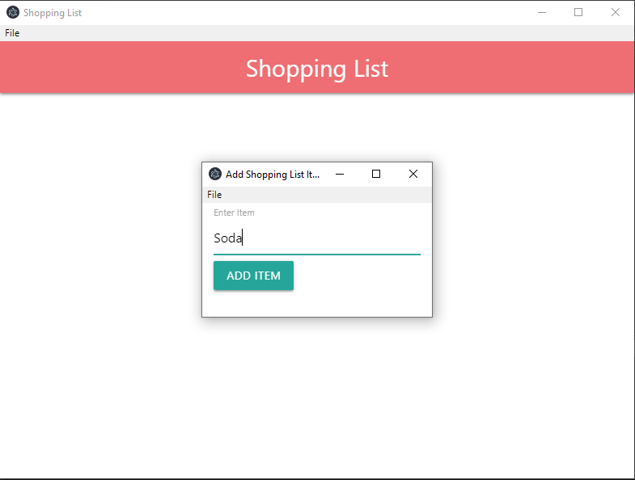
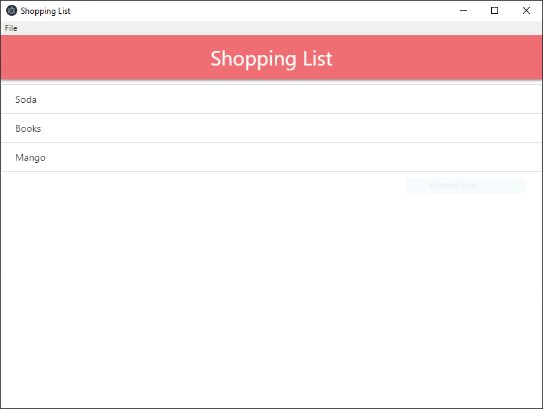

# Electron Shopping List

This is my first app using Electron.js, it's a shopping list that enables you to add, remove, or clear all items.

## Getting Started

These instructions will get you a copy of the project up and running on your local machine for development and testing purposes. See deployment for notes on how to deploy the project on a live system.

### Prerequisites

* Node.JS
* Electron Framework

### Installing

* Clone the repo
* cd to the repo's directory
* open a terminal window on that directory
* type `npm install`
* after it is done, type `npm start`
After that, the app will be opened automatically.

## Deployment

[Electron-forge](https://github.com/electron-userland/electron-forge) is a packaging tool for deploying electron apps.

## Built With

* [Node.JS](https://nodejs.org/en/) - JS runtime framework
* [Electron](https://electronjs.org/) - JS framework for building desktop apps.

## Authors

* **Abdulrahman Elsharqawi**

## License

This project is licensed under the MIT License
